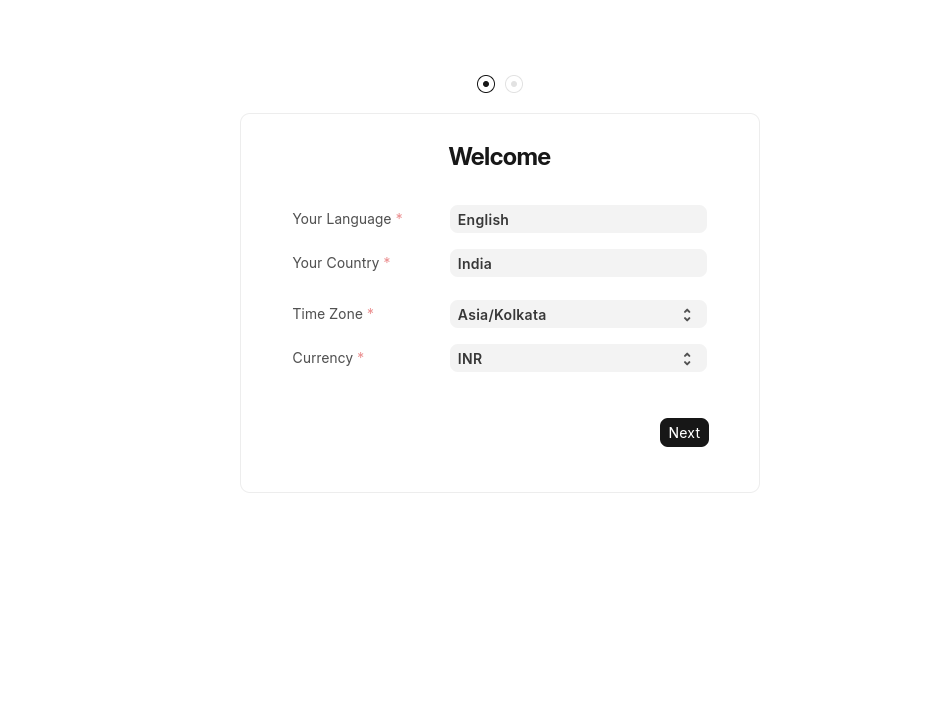

## Setup for Debian: 


- Installation guide
    - https://docs.frappe.io/framework/user/en/installation#debian--ubuntu


MariaDB 10.6.6+                               (11.3 is recommended on develop)
Python 3.10+
Node 18+
Redis 6                                       (caching and realtime updates)
yarn 1.12+                                    (js dependency manager)
pip 20+                                       (py dependency manager)
wkhtmltopdf (version 0.12.5 with patched qt)  (for pdf generation)
cron                                          (bench's scheduled jobs: automated certificate renewal, scheduled backups)


```bash

sudo apt update

sudo apt install git python-is-python3 python3-dev python3-pip redis-server libmariadb-dev mariadb-server mariadb-client pkg-config

```

## Database


## 2. Bench initialization:

- bench init genhrms-bench --frappe-branch version-15

## 3. Site creation

- genhrms.local

## 4 App installation:


### ERPNext and HRMS:

- bench get-app erpnext --branch version-15


- bench get-app hrms --branch version-15


- Installing at site: 

    - bench --site genhrms.local install-app erpnext
    - bench --site genhrms.local install-app hrms


---


## Running the bench:

### Initial setup: 




## 5 Admin 

site administration:
- Create Site admin and password


## 6. Custom App creation and installation

- bench new-app gen-hrms

- bench --site genhrms.local install-app gen_hrms

- Add app to github

```bash
git remote add origin git@github.com:atulgen/gen_hrms.git
git branch -M main
git push -u origin main
```

- Repo link: https://github.com/atulgen/gen_hrms


- bench get-app https://github.com/atulgen/gen_hrms


